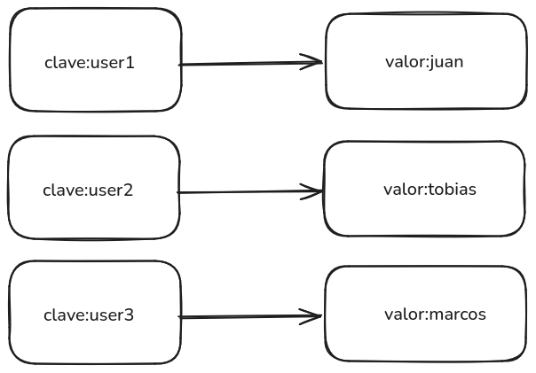
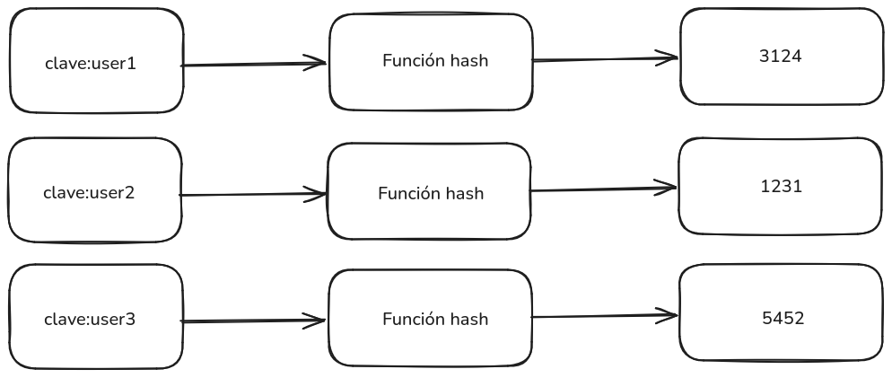
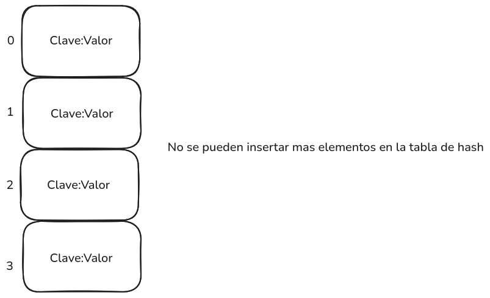
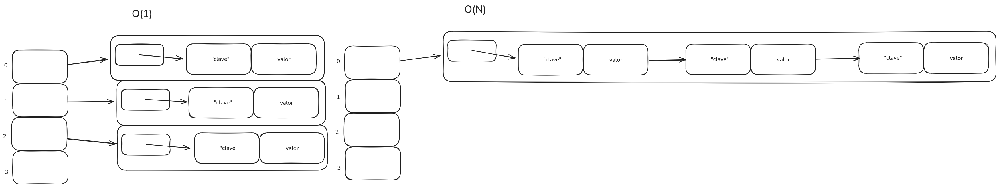

<div align="right">

</div>

# TDA HASH

## Repositorio de Tobias Portella - 112257 - tobias240405@gmail.com

- Para compilar:

```bash
gcc -std=c99 -Wall -Wconversion -Wtype-limits -pedantic -Werror -O2 -g src/*.c tp_hash.c -o tp_hash 
```

- Para ejecutar:

```bash
./tp_hash pokedex.csv
```

- Para ejecutar con valgrind:
```bash
valgrind --leak-check=full --track-origins=yes --show-reachable=yes --error-exitcode=2 --show-leak-kinds=all --trace-children=yes ./tp_hash pokedex.csv
```
---
##  Funcionamiento

---El programa se encarga de recibir un archivo de pokemones con sus atributos y luego almacenarlos en un hash, luego el programa pedirá que elijas una de dos opciones las cuales una va a ser imprimir todos los pokemones y sus atributos por pantalla, y la otra va a ser buscar un pokemon escribiendo su nombre por entrada estándar

---el programa va a abrir un archivo CSV el cual va a contener los atributos de unos pokemones y lo va leer linea por linea usando la función leer_linea_csv, a esta función se le va a pasar el archivo, la cantidad de columnas que se desean leer, una función que recibe el string leído y un puntero al contexto, y por ultimo recibe también un puntero a un contexto. La función se va a ejecutar hasta que el archivo se quede sin lineas para leer, también se va a ejecutar la función hash_insertar() la cual va a agregar a los pokemones y los va a ordenar por su nombre.

---Luego va a haber un while que va a iterar hasta que se elija una opción por entrada estandar correctamente, las opciones van a ser ingresar el nombre de un pokemon por entrada estandar y buscarlo o mostrar todos los pokemon leidos del archivo por pantalla.

---Utilizamos la función hash_iterar  para imprimir todos los pokemones por pantalla pasandole por parametro la función imprimir_pokemones_por_pantalla() la cual imprimre por pantalla los atributos del pokemon pasado

---La otra función es encontrar_pokemon_buscado() usa abb_obtener para buscar el pokemon ingresado por entrada estandar y luego esta lo imprime por pantalla

---Luego al finalizar el programa se libera toda la memoria del programa usando sus respectivas funciónes de liberación.
## Respuestas a las preguntas teóricas

### Qué es un diccionario

---Un diccionarios es un TDA el cual se caracteriza por tener una clave asociada a los valores ingresados, por lo que se buscaría al elemento por la clave y no por el valor, no existen las claves repetidas
Incluír acá las respuestas a las preguntas del enunciado (si aplica).

<div align="center">

</div>

### Explicá 3 formas diferentes de implementar un diccionario (tabla de hash cuenta como 1)

---Una forma de implementar un diccionario es con una tabla de hash, esta implementación usa una función de hash para transformar 
la clave en un indice de la tabla, intentando acercar su busqueda a una complejidad de O(1). otra forma de implementar un diccionario 
seria con una lista y que cada elemento de la lista sea una estructura que almacene la clave y el valor, esto tendría una complejidad para 
buscar de O(n). un diccionario se podria implementar con infinidad de estructuras de datos, otro ejemplo de esto sería implementarlo 
con un abb y almacenar una estructura con clave y valor de elemento.

### Qué es una función de hash y qué características debe tener para nuestro problema en particular

---Una función hash es una función que convierte un elemento pasado en otro, ya sea un numero, una cadena, etc, siendo estos 
elementos de salida finitos, esta función en nuestro caso necesitamos que dado una cadena de caracteres la salida seam enteros, vamos a 
tratar que la función de un numero diferente para distintas cadena de caracteres así cada cadenas tiene un propio numero asociado.

<div align="center">

</div>

### Qué es una tabla de Hash y los diferentes métodos de resolución de colisiones vistos (encadenamiento, probing, etc)

---Una tabla de hash es una estructura de datos que se utiliza para almacenar y acceder a información de manera 
rápida, En una tabla de hash, los datos se almacenan en índices calculadas por una función de hash. 

---El encadenamiento es un  metodo para resolver colisiones en tablas de hash. Consiste en almacenar las claves y 
valores que colisionan en una estructura de datos ya sea lista, arbol, etc, en cada posición de la tabla de hash.

---El probing es un metodo para resolver colisiones que cuando ocurre una colisión, se busca la siguiente posición 
libre en la tabla para insertar el nuevo valor.

### Explique por qué es importante el tamaño de la tabla (tanto para tablas abiertas como cerradas)

---El tamaño de la tabla de hash afecta rendimiento de cualquier tabla de hash ya que mientras el tamaño es finito y los elementos son 
infinitos, ya sea que se utilice un hash abierto o cerrado.  El tamaño de la tabla afecta directamente tanto a la eficiencia de  almacenamiento como al 
rendimiento de las operaciones en la tabla (búsqueda, inserción, eliminación), y un mal ajuste del tamaño puede llevar a un mal rendimiento


<div align="center">

</div>

### Dado que en una tabla abierta se pueden encadenar colisiones sin importar el tamaño de la tabla, ¿Realmente importa el tamaño?

si, es importante, ya que si hay muchas colisiones en un mismo indice el rendimiento del hash no va a ser el buscado, ya que al tener todo apilado 
en un mismo indice la compllejidad pasaría de O(1) a O(n)
<div align="center">

</div>

